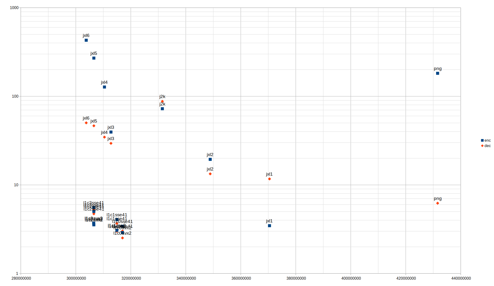

# L1 Codec

Low-complexity lossless image compression software.
Uses a novel weighted predictor based on L1 loss and a novel causal RCT.
AVX2 and SSE4.1 versions.

In addition, `pred` is a reference source for the novel low-complexity decorrelation system.

## Building
Each folder contains a different project.
To build use GNU Make or create MSVC2022 CMake projects.

## Command-line
### Encoding
`l1c.exe  input.ppm  output.l1c  [effort]`

Where effort is {0, 1, 2, 3}. Higher effort should compress better but slower.
Only 24-bit PPM images are supported.

Effort levels 1 till 3 are for photographic content.

Effort level 0 is best suited for synthetic content with flat areas and screenshots (also the fastest).

### Decoding
`l1c.exe  input.l1c  output.ppm`

### Lossless predictor
`pred.exe  p|r  input.ppm  output.ppm`

p: Predict

r: Reconstruct

## Benchmarks

DIV2K validation: (100 images)

CPU: Intel i5-1145G7

All tests are single-threaded.

| size | Enc sec | Dec sec | Enc MB/s | Dec MB/s | Enc Max Mem MB | Dec Max Mem MB | Codec |
|------|---------|---------|----------|----------|----------------|----------------|-------|
| 303783780 |    429.425 |   50.190 |      1.888 |   16.160 |   354.47 |   52.37 |  jxl6				|
| 306470372 |      3.699 |    3.704 |    219.233 |  218.973 |    44.17 |   32.94 |  l1c3avx2				|
| 306470372 |      5.543 |    5.235 |    146.325 |  154.921 |    44.18 |   32.93 |  l1c3sse41				|
| 306523202 |      3.544 |    3.622 |    228.856 |  223.898 |    44.18 |   32.95 |  l1c2avx2				|
| 306523202 |      5.022 |    4.718 |    161.500 |  171.903 |    44.18 |   32.94 |  l1c2sse41				|
| 306560721 |    269.989 |   46.500 |      3.004 |   17.443 |   354.43 |   52.18 |  jxl5				|
| 310416509 |    127.341 |   34.636 |      6.369 |   23.417 |   247.37 |   52.42 |  jxl4				|
| 312783166 |     39.514 |   29.472 |     20.526 |   27.521 |   246.16 |   52.20 |  jxl3				|
| 314889936 |      3.076 |    3.000 |    263.688 |  270.309 |    44.17 |   32.94 |  l1c1avx2				|
| 314889936 |      4.057 |    3.673 |    199.881 |  220.807 |    44.18 |   32.95 |  l1c1sse41				|
| 316933800 |      2.900 |    2.520 |    279.671 |  321.818 |    44.17 |   32.94 |  l1c0avx2				|
| 316933800 |      3.412 |    3.014 |    237.718 |  269.095 |    44.18 |   32.93 |  l1c0sse41				|
| 331476186 |     72.400 |   87.809 |     11.203 |    9.237 |    93.14 |   58.44 |  j2k					|
| 348879679 |     19.425 |   13.334 |     41.754 |   60.829 |   246.80 |   52.52 |  jxl2				|
| 370447667 |      3.467 |   11.689 |    233.921 |   69.387 |    47.77 |   35.05 |  jxl1				|
| 431594628 |    181.847 |    6.216 |      4.460 |  130.473 |    55.90 |   28.01 |  png (fPNG + pingo + stb_image.h)	|
| 850510339 | PPM |

