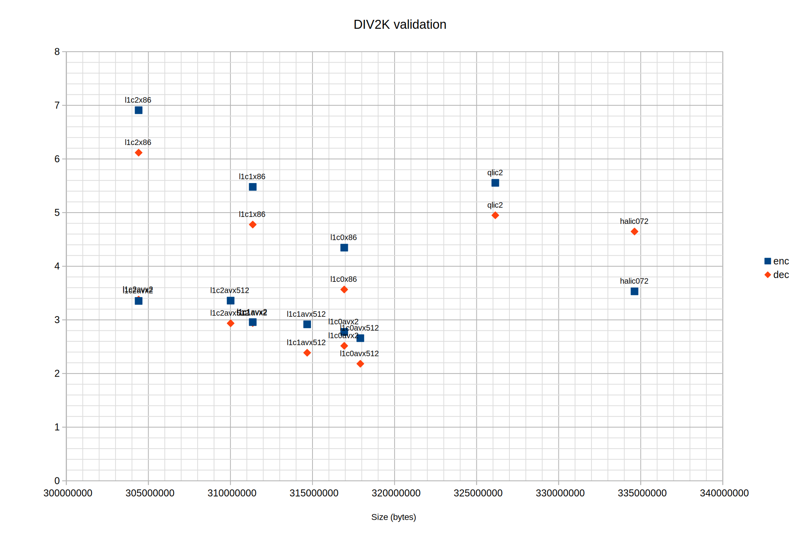
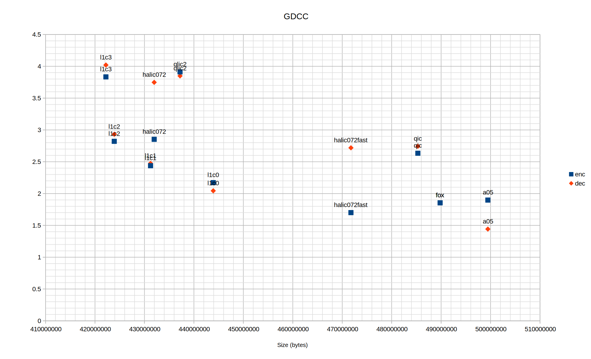

# L1 Codec

Low-complexity lossless image compression software.
Uses a novel weighted predictor based on L1 loss and a novel causal RCT.

### Publications
- "L1-based prediction for lossless image compression." IEEE Signal Processing Letters (2025).
- "Causal Reversible Color Transform." IEEE Signal Processing Letters (2025).

### Modules & Architectures
- SSSE3: i386 / x86_64. Incompatible with others.
- SSE4.1: i386 / x86_64.
- AVX2: Compatible with SSE4.1.
- AVX512: Incompatible with others.

[TODO] Unify bitstream.

In addition, `pred` is a reference source for the novel low-complexity decorrelation system.

## Building
Each folder contains a different project.
To build use GNU Make or create MSVC2022 CMake projects.

## Command-line

### Encoding
`l1c.exe  input.ppm  output.l1c  [effort]  [dist]`

Only 24-bit PPM images are supported.

Effort = {0, 1, 2, 3}. Default is 2. Higher effort should compress better but slower.

Effort levels 1 till 3 are for photographic content.

Effort level 0 is best suited for synthetic content with flat areas and screenshots (also the fastest).
While effort 3 is for noisy photos.

### Decoding
`l1c.exe  input.l1c  output.ppm`

### Lossless predictor
`pred.exe  p|r  input.ppm  output.ppm`

p: Predict

r: Reconstruct

## Benchmarks

Encode time (sec) vs size (bytes).
All tests are single-threaded.

### Dataset: DIV2K validation (100 images)

CPU: Intel i5-1145G7

| size      | Enc sec    | Dec sec  | Enc MB/s   | Dec MB/s | Enc Max Mem MB | Dec Max Mem MB | Codec |
|----------:|-----------:|---------:|-----------:|---------:|---------------:|---------------:|-------|
| 303783780 |    429.425 |   50.190 |      1.888 |   16.160 |         354.47 |          52.37 |  jxl6					|
| 304406852 |      3.353 |    3.378 |    241.857 |  240.076 |          44.14 |          32.89 |  l1c2avx2				|
| 304406852 |      6.909 |    6.118 |    117.385 |  132.567 |          44.14 |          32.90 |  l1c2x86				|
| 306560721 |    269.989 |   46.500 |      3.004 |   17.443 |         354.43 |          52.18 |  jxl5					|
| 310011134 |      3.359 |    2.936 |    241.464 |  276.188 |          44.61 |          33.38 |  l1c2avx512				|
| 310416509 |    127.341 |   34.636 |      6.369 |   23.417 |         247.37 |          52.42 |  jxl4					|
| 311359320 |      2.958 |    2.941 |    274.204 |  275.711 |          44.14 |          32.91 |  l1c1avx2				|
| 311359320 |      5.480 |    4.777 |    147.992 |  169.771 |          44.15 |          32.92 |  l1c1x86				|
| 312783166 |     39.514 |   29.472 |     20.526 |   27.521 |         246.16 |          52.20 |  jxl3					|
| 314674956 |      2.917 |    2.387 |    277.988 |  339.794 |          44.61 |          33.37 |  l1c1avx512				|
| 316933800 |      2.776 |    2.516 |    292.120 |  322.308 |          44.14 |          32.92 |  l1c0avx2				|
| 316933800 |      4.347 |    3.566 |    186.590 |  227.443 |          44.14 |          32.92 |  l1c0x86				|
| 317914326 |      2.659 |    2.182 |    304.943 |  371.677 |          44.59 |          33.35 |  l1c0avx512				|
| 326140006 |      5.555 |    4.950 |    146.011 |  163.832 |          32.59 |          32.82 |  qlic2					|
| 331476186 |     72.400 |   87.809 |     11.203 |    9.237 |          93.14 |          58.44 |  j2k					|
| 334622891 |      3.532 |    4.648 |    229.610 |  174.487 |           9.19 |           8.02 |  halic072				|
| 348879679 |     19.425 |   13.334 |     41.754 |   60.829 |         246.80 |          52.52 |  jxl2					|
| 370447667 |      3.467 |   11.689 |    233.921 |   69.387 |          47.77 |          35.05 |  jxl1					|
| 431594628 |    181.847 |    6.216 |      4.460 |  130.473 |          55.90 |          28.01 |  png (fPNG + pingo + stb_image.h)	|
| 850510339 | PPM |

### Dataset: GDCC (100 images, 1000452004 bytes)

CPU: Intel i7-13700KF

