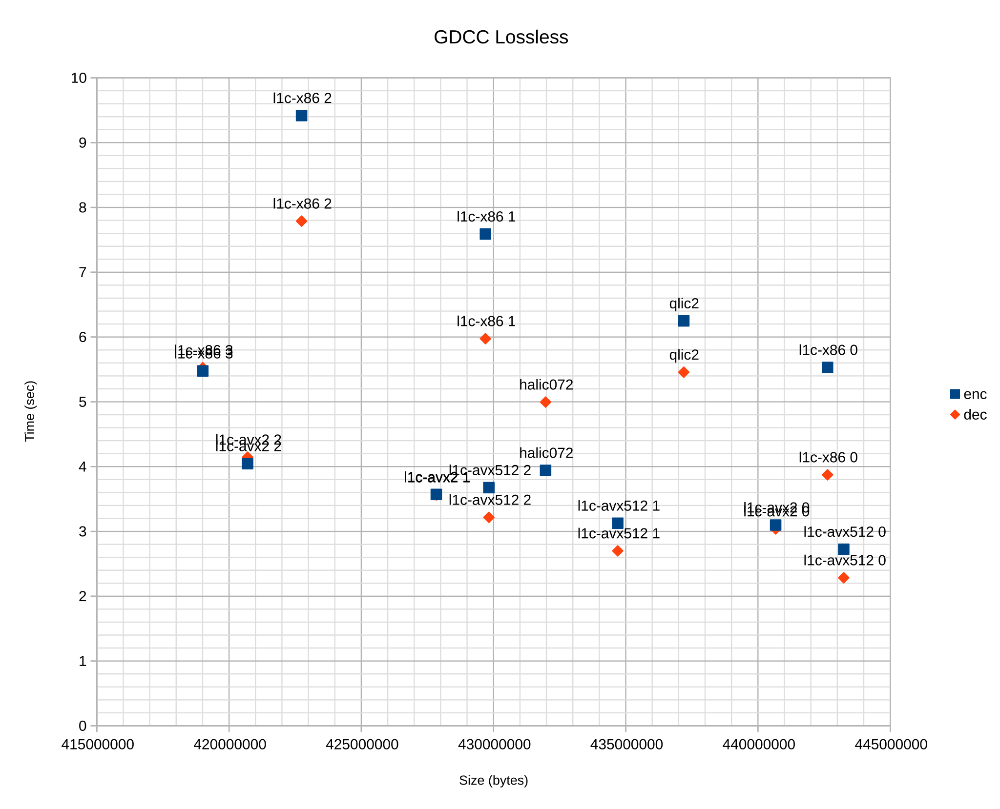
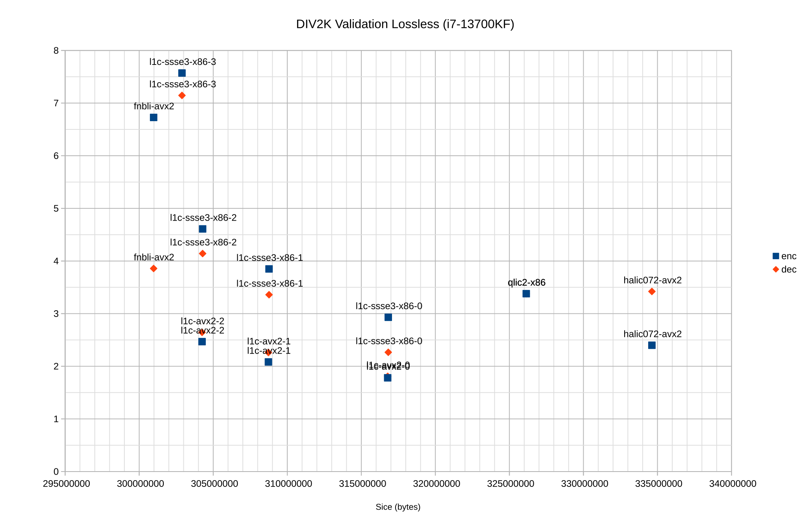
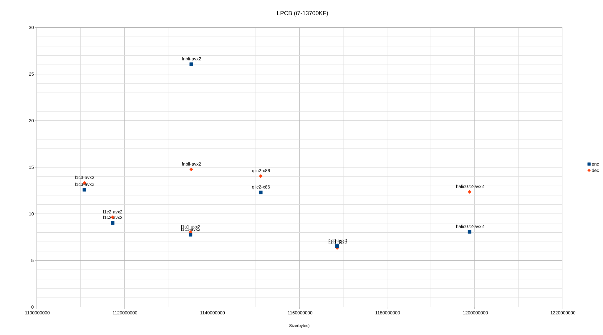

# L1 Codec

Low-complexity lossless image compression software.
Uses a novel weighted predictor based on L1 loss and a novel causal RCT.

### Publications
- "L1-based prediction for lossless image compression." IEEE Signal Processing Letters (2025).
- "Causal Reversible Color Transform." IEEE Signal Processing Letters (2025).

### Modules & Architectures
- SSSE3: i386 / x86_64. Incompatible with others.
- SSE4.1: i386 / x86_64.
- AVX2: Compatible with SSE4.1.
- AVX512: Incompatible with others.

[TODO] Unify bitstream.

In addition, `pred` is a reference source for the novel low-complexity decorrelation system.

## Building
Each folder contains a different project.
To build use GNU Make or create MSVC2022 CMake projects.

## Command-line

### Encoding
`l1c.exe  input.ppm  output.l1c  [effort]  [dist]`

Only 24-bit PPM images are supported.

Effort = {0, 1, 2, 3}. Default is 2. Higher effort should compress better but slower.

Effort levels 1 till 3 are for photographic content.

Effort level 0 is best suited for synthetic content with flat areas and screenshots (also the fastest).
While effort 3 is for noisy photos.

### Decoding
`l1c.exe  input.l1c  output.ppm`

### Lossless predictor
`pred.exe  p|r  input.ppm  output.ppm`

p: Predict

r: Reconstruct

## Benchmarks

Encode time (sec) vs size (bytes).
All tests are single-threaded.

### Dataset: GDCC 2020 (100 images)

100 images. 1,000,452,004 bytes.
CPU: Intel i5-1145G7.

| size       | Enc sec    | Dec sec  | Enc MB/s   | Dec MB/s | Enc Max Mem MB | Dec Max Mem MB | Codec |
|-----------:|-----------:|---------:|-----------:|---------:|---------------:|---------------:|-------|
|  418468294 |   1265.060 |   63.067 |      0.754 |   15.128 |         204.00 |          48.52 |  jxl8					|
|  419008596 |      5.476 |    5.526 |    174.230 |  172.651 |          59.00 |          43.35 |  l1c-avx2 3				|
|  420036116 |     15.515 |   13.978 |     61.491 |   68.252 |          60.80 |          45.15 |  l1c-ssse3-x86 3			|
|  420702144 |      4.044 |    4.145 |    235.907 |  230.146 |          59.10 |          43.47 |  l1c-avx2 2				|
|  421242767 |    736.171 |   66.936 |      1.296 |   14.253 |         252.00 |          48.32 |  jxl7					|
|  422741576 |      9.417 |    7.788 |    101.315 |  122.508 |          60.26 |          44.60 |  l1c-ssse3-x86 2			|
|  426404724 |      9.849 |    5.793 |     96.865 |  164.686 |          58.75 |          29.41 |  [fnbli-avx2](https://github.com/WangXuan95/NBLI)	|
|  427835408 |      3.570 |    3.562 |    267.182 |  267.784 |          59.00 |          43.36 |  l1c-avx2 1				|
|  428690266 |    433.208 |   55.512 |      2.202 |   17.187 |         252.00 |          48.37 |  jxl6					|
|  429694828 |      7.589 |    5.974 |    125.715 |  159.683 |          60.25 |          44.59 |  l1c-ssse3-x86 1			|
|  429824344 |      3.675 |    3.216 |    259.618 |  296.603 |          59.59 |          43.94 |  l1c-avx512 2				|
|  431969273 |      3.941 |    4.995 |    242.046 |  190.994 |          10.31 |           9.10 |  [halic072-avx2](https://github.com/Hakan-Abbas/HALIC-High-Availability-Lossless-Image-Compression)	|
|  434697586 |      3.126 |    2.699 |    305.150 |  353.400 |          59.58 |          43.94 |  l1c-avx512 1				|
|  435003722 |    266.294 |   54.185 |      3.582 |   17.608 |         252.06 |          48.36 |  jxl5					|
|  437196023 |      6.249 |    5.457 |    152.675 |  174.811 |          43.07 |          46.48 |  [qlic2-x86](http://qlic.altervista.org/)	|
|  440668692 |      3.098 |    3.038 |    307.885 |  313.969 |          58.99 |          43.35 |  l1c-avx2 0				|
|  442629118 |      5.530 |    3.873 |    172.523 |  246.333 |          60.25 |          44.59 |  l1c-ssse3-x86 0			|
|  443241442 |      2.724 |    2.284 |    350.163 |  417.638 |          59.55 |          43.91 |  l1c-avx512 0				|
|  446934732 |    140.857 |   39.939 |      6.773 |   23.888 |         210.22 |          48.56 |  jxl4					|
|  451822944 |     42.664 |   31.744 |     22.362 |   30.055 |         209.45 |          48.53 |  jxl3					|
|  452980471 |     93.601 |  110.378 |     10.193 |    8.643 |         134.60 |          81.79 |  j2k					|
|  467594871 |     23.015 |   15.525 |     41.454 |   61.455 |         209.54 |          48.77 |  jxl2					|
|  501018412 |    299.586 |   10.114 |      3.184 |   94.332 |          75.17 |          36.86 |  png (fPNG + pingo + stb_image.h)	|
|  502557866 |      3.837 |   13.497 |    248.618 |   70.685 |          73.41 |          48.98 |  jxl1					|
| 1000452004 | PPM |

### Dataset: DIV2K Validation

100 images, 850,510,339 bytes.
CPU: Intel i7-13700KF.

### Dataset: Lossless Photo COmpression Benchmark (LPCB)

107 images, 3,462,571,880 bytes.
CPU: Intel i7-13700KF.

